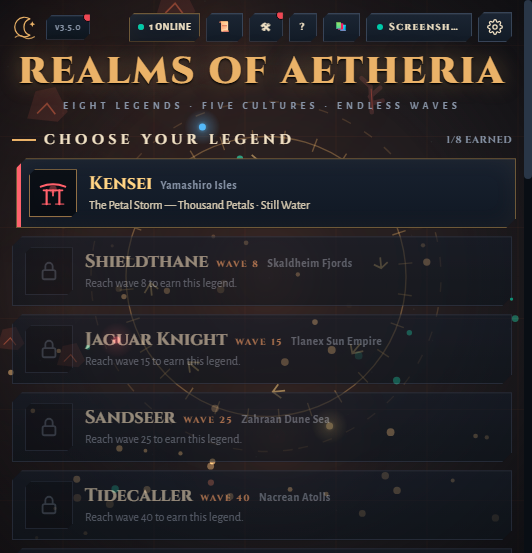
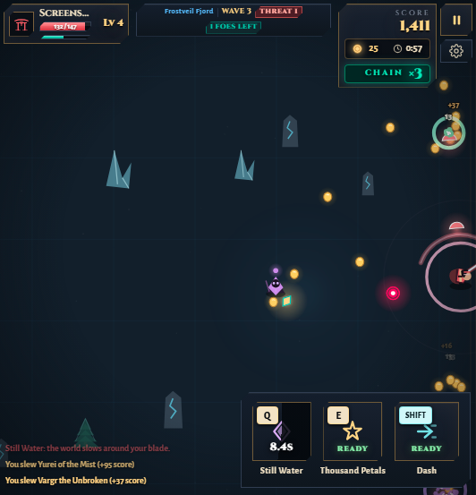
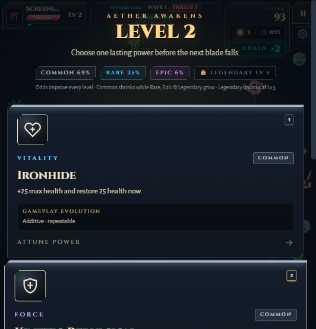

# Realms of Aetheria

**A pocket MMORPG in your browser.** Top-down canvas action-RPG: pick a legend, survive endless waves, draft powers on level-up, trade at the traveling market, and slay realm bosses — solo offline or with cloud accounts and a live leaderboard.



| | |
|---|---|
|  |  |
| *Wave 3 combat — chain kills, gold, abilities on cooldown* | *Level-up draft with live rarity odds* |

## Features

- **8 playable legends**, each with its own weapon archetype, signature + legacy abilities, and 3-tier evolution powers (unlock by reaching waves 8–100)
- **Endless waves** across 5 realms with escalating difficulty, elites, and a **boss every 5th wave** (realm-specific variants)
- **Level-up power drafts** — 3 cards from a weighted rarity pool (Common / Rare / Epic / Legendary, unlocks at Lv 5), with 3 shared rerolls
- **Traveling market** between waves — wave-gated rarities (Epic W5, Legendary W10), hold slots, restocks
- **Local + cloud accounts** — plays fully offline via localStorage; add Supabase for cloud saves and the realm leaderboard
- **Fully procedural audio** — synthesized SFX and per-zone/boss music (WebAudio), zero external assets
- **PWA** — install to your phone's home screen and play offline
- Touch controls + keyboard/mouse support

## Play

The game is a single self-contained `index.html` build — host `dist/` anywhere, or run locally:

```bash
npm install
npm run dev      # development server
npm run build    # production build → dist/index.html (single file)
```

### Cloud backend (optional)

Works offline out of the box. To enable cloud accounts + leaderboard:

1. Create a Supabase project and run the migrations in `supabase/migrations/` (0001 → 0005) in the SQL Editor.
2. Copy `.env.example` to `.env` and fill in `VITE_SUPABASE_URL` and `VITE_SUPABASE_ANON_KEY`.
3. Rebuild. The anon key is public by design — row-level security protects the data. **Never commit `.env`.**

## Controls

| Action | Key |
|---|---|
| Move | WASD / Arrows |
| Attack (hold) | Mouse hold / Space |
| Dash (i-frames) | Shift |
| Signature ability | E |
| Legacy ability | Q |
| Choose power / reroll | 1 · 2 · 3 / R |
| Pause | Esc |

On touch devices, on-screen controls appear automatically.

## Tech stack

Vite · React 19 · TypeScript · Tailwind CSS v4 · WebAudio · Supabase (optional) · single-file production build

The simulation lives in `src/game/engine.ts`; see `CONTINUE.md` for the architecture map.

## Install as an app (PWA)

Open the deployed site on your phone → *Add to Home Screen*. The service worker caches the whole game for offline play.
